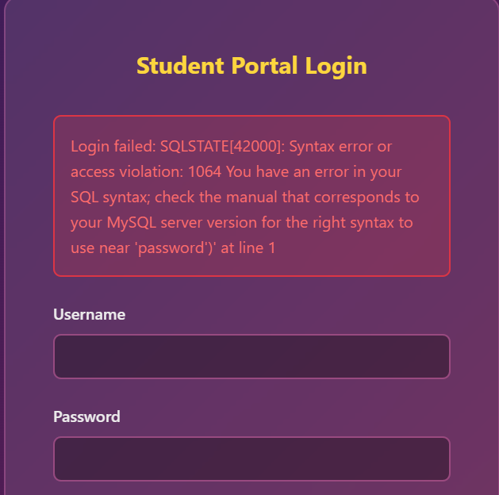
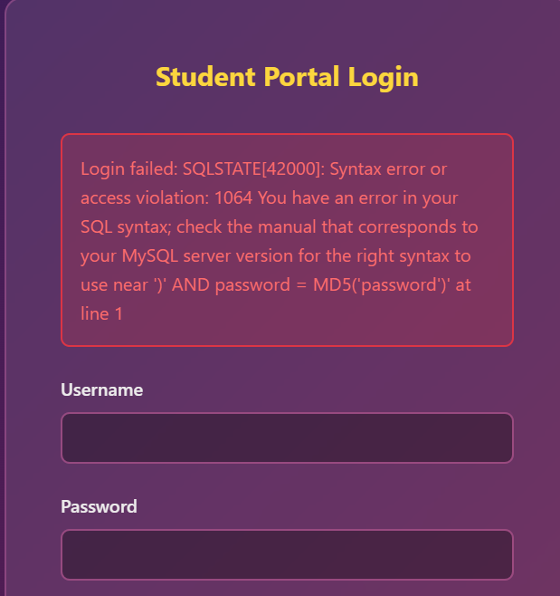
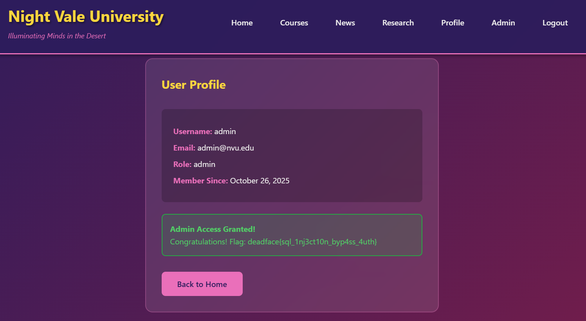

# Access Granted

## Description
We need to gain authenticated access to the web app, but we want to see if we can do it the way DEADFACE did. NVU admits they haven’t fixed anything regarding their authentication process. See if you can login to the web app.

## Flag
deadface{sql_1nj3ct10n_byp4ss_4uth}

## Steps
1. Pada challenge ini, kita diminta untuk login ke web app. Kerentanan yang sering ditemukan pada proses autentikasi seperti login ini adalah SQL injection.

2. Kita akan mulai dengan memberikan input `'` pada username dan `password`pada password untuk melihat apakah login page memiliki kerentanan SQL injection.

3. Ternyata log error sql ditampilkan ke user. Dengan ini kita tahu bahwa terdapat kerentanan SQL injection pada login page.

4. Kita mulai dengan asumsi query login sql paling basic, yaitu `SELECT * FROM users WHERE username = '$username' AND password = '$password';`. Namun query ini tidak sesuai berdasarkan error log yang diberikan, yaitu pada bagian `near 'password')' at line 1`. Input password berada di dalam tanda `()`, kita coba payload lain untuk mengecek apa fungsi dari tanda kurung ini. 
 
5. Kita coba input `')` pada username untuk mencari tahu apakah kita bisa menutup tanda kurung tersebut.

6. Dari error log ini, pada bagian `near ')' AND password = MD5('password')' at line 1`, Semakin memperjelas kemungkinan query sql yang digunakan yaitu `SELECT * FROM users WHERE username = '$username' AND password = MD5('$password');`

7. Dengan begini kita bisa mencoba payload yang mungkin berhasil berdasarkan asumsi query sql diatas, yaitu `' OR '1'='1' -- `. Pastikan terdapat spasi setelah `--` agar dieksekusi sebagai komentar.

8. Dan kita berhasil login sebagai admin tanpa harus memberikan input password yang benar.