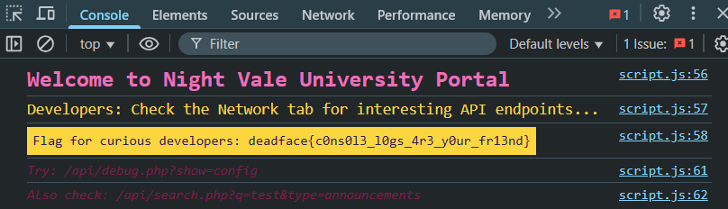
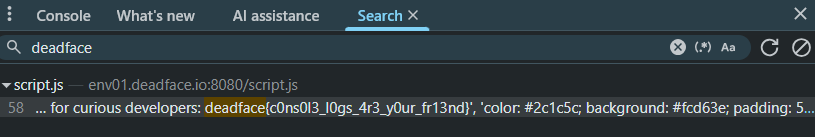

# Console Chaous

## Description
Let’s make sure NVU cleaned up some of the comments in their codebase. We don’t need them publicizing information that would help tip off DEADFACE. Use built-in browser tools to find any flags that we might have missed so far.

## Flag
deadface{c0ns0l3_l0gs_4r3_y0ur_fr13nd}

## Steps
1. Berdasarkan deskripsi challenge, kita diminta untuk menggunakan tools built-in dari browser untuk mencari flag yang terlewat. Salah satu tool yang bisa kita gunakan adalah console.

2. Flag langsung terlihat ketika kita membuka console. Cara lainnya, kita bisa menggunakan tool search, karena kita mengetahui format flagnya adalah diawali deadface.

