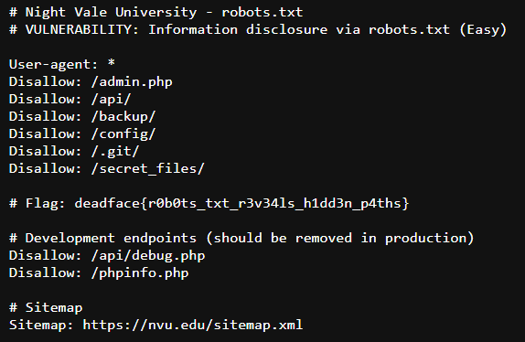

# Hidden Paths

## Description
NVU claims that they need their site SEO-optimized and that their site needs to allow web crawlers to access certain directories. But we’re almost certain this gave DEADFACE the intel they needed to plan their attack on the site. Find the flag associated with the document that web crawlers are meant to access.

## Flag
deadface{r0b0ts_txt_r3v34ls_h1dd3n_p4ths}

## Steps
1. Lokasi flag pada challenge ini tertulis jelas di deskripsi, yaitu dokumen yang memang khusus diakses untuk web crawlers, yaitu `robots.txt`. Jadi kita akan akses file tersebut.

2. Bisa dilihat kita menemukan flag yang dimaksud pada file `robots.txt`.