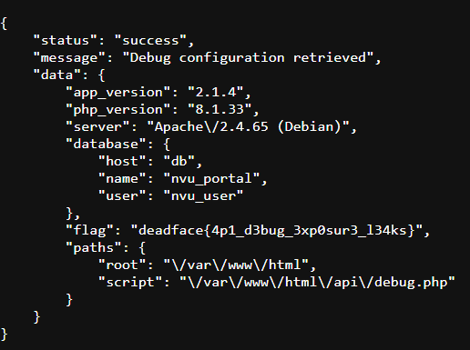

# Pest Control

## Description
NVU has an API that we believe was leveraged by DEADFACE to gain configuration information that aided them in their attack on NVU’s website. The API likely exposes sensitive information.

## Flag
deadface{4p1_d3bug_3xp0sur3_l34ks}

## Steps
1. Pada deskripsi kita mengetahui bahwa DEADFACE mendapatkan informasi konfigurasi web milik NVU. Jadi, kita harus mencari lokasi file konfigurasi dari web NVU.

2. Pada console, terdapat hint yaitu 'Try: /api/debug.php?show=config', kita bisa coba akses endpoint tersebut.

3. Dan benar, endpoint ini dapat diakses oleh publik dan memiliki informasi konfigurasi web beserta flag challenge ini.