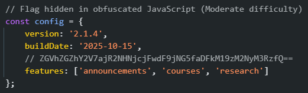
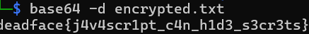

# Stick to the Script

## Description
NVU thought they were being clever by obfuscating some of their code, but DEADFACE was able to figure it out. Despite this, NVU hasn’t remediated the issue; we’re pretty sure the secret they tried to hide in their code is still there - easily readable to anyone who sees it. Find the flag that is obfuscated in the web app’s code.

## Flag
deadface{j4v4scr1pt_c4n_h1d3_s3cr3ts}

## Steps
1. Pada challenge ini kita diminta mencari obfuscated flag pada kode web app. Kita akan mulai cari dari `script.js`.

2. Pada object `config`, Kita bisa melihat baris yang berisi string terenkripsi. Umumnya enkripsi yang diakhiri `==` sering diasumsikan sebagai enkripsi base64. 

3. Untuk memvalidasinya kita bisa menggunakan built-in tools linux yaitu `base64`, dengan perintah `base64 -d encrypted.txt`, dimana `encrypted.txt` berisi string enkripsi yang kita temukan pada `script.js` tadi.
