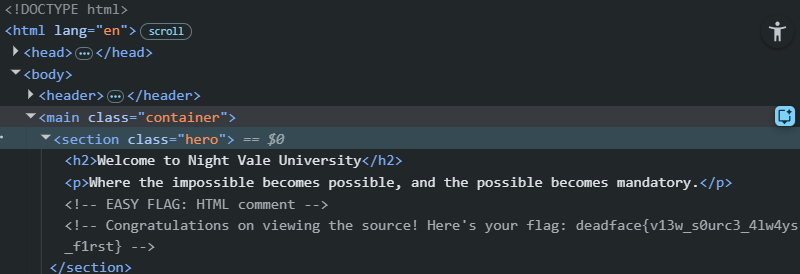

# The Source of Our Troubles

## Description
DEADFACE compromised Night Veil University’s student portal website. NVU swears up and down that they’ve secured the site, but the school leaderships wants us to validate that their site is no longer vulnerable. DEADFACE left several artifacts throughout the web app to taunt school staff. See if you can compromise the web app and find the artifacts left behind by DEADFACE.

Let’s start by finding any artifacts on NVU’s homepage.

## Flag
deadface{v13w_s0urc3_4lw4ys_f1rst}

## Steps
1. Pada challenge ini, kita diminta untuk melihat apakah masih ada jejak yang sengaja ditinggalkan oleh DEADFACE pada halaman web NVU. Kita akan selalu mulai dengan menganalisis page sourcenya.

2. Ternyata terdapat jejak DEADFACE dalam bentuk HTML comment.