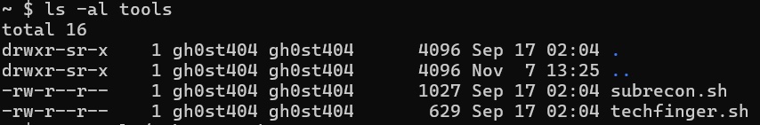
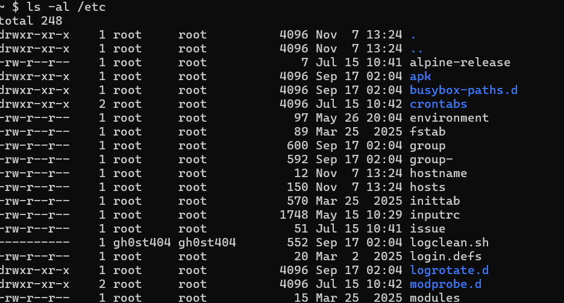
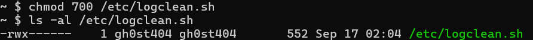
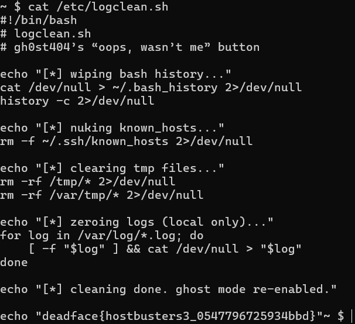

# Et Cetera

## Description
gh0st404 is complaining in Ghost Town about his script not working. See if you can locate the script on the remote machine and read the flag.

## Flag

## Steps
1. Berdasarkan deskripsi challenge, kita diminta untuk mencari script milik gh0st404. Pada direktori home milik gh0st404, terdapat direktori `tools` yang kemungkinan berisi script tools pribadinya.

2. Namun jika kita buka file tersebut dengan perintah `cat`, tidak ada keanehan dalam scriptnya. Lalu, dimana lagi gh0st404 menyimpan script miliknya? Kemungkinan lokasi lainnya adalah direktori `/etc`. Direktori ini memang berisi banyak sekali script, termasuk konfigurasi sistem. Kita coba lihat daftar file dalam direktori `/etc` dan lihat apakah ada file yang dimiliki oleh gh0st404 dengan command `ls -al /etc`.

3. Ternyata benar ada file yang dimiliki oleh gh0st404 di direktori `/etc`, yaitu `logclean.sh`. Namun file ini belum bisa kita buka karena permission file tersebut dikonfigurasi untuk tidak bisa dibuka oleh siapapun termasuk user gh0st404. 

4. Kita bisa gunakan `chmod` untuk mengubah permission file `logclean.sh` dengan perintah `chmod 700 /etc/logclean.sh`. Perintah ini akan membuat user gh0st404 (user yang kita gunakan sekarang) memiliki permission untuk read, write, dan execute file tersebut.

5. Setelah permission berhasil diubah, kita kini bisa membaca isi script `logclean.sh` dengan perintah `cat /etc/logclean.sh` dan mendapatkan flagnya.
