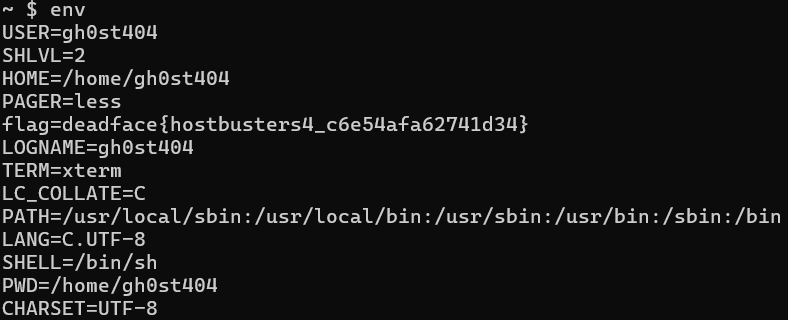

# Lay of the Land

## Description
Scope out and continue characterizing the host. What are some of the characters of this environment? Find the flag associated with hostbusters4.

## Flag
flag=deadface{hostbusters4_c6e54afa62741d34}

## Steps
1. Berdasarkan deskripsi challenge, kita diminta untuk mencari karakter di environment. Jika begitu kita bisa menggunakan perintah `env` untuk menampilkan environment variables sistem.

2. Kita langsung menemukan flag pada daftar environment variables yang ditampilkan.