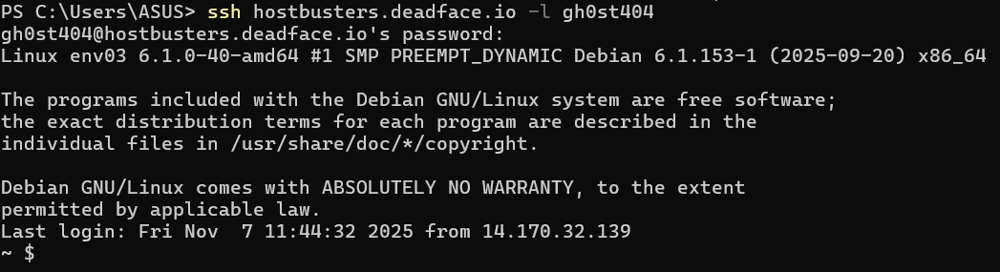
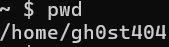
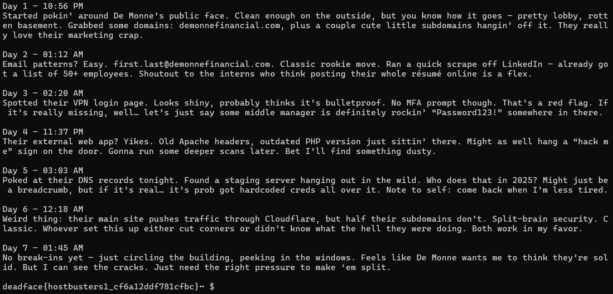

# Let Me In

## Description
Due to the efforts of the Turbo Tactical team, we’ve managed to acquire credentials belonging to gh0st404 that can be used on a remote DEADFACE machine. Access this machine and find the flag in the user’s home directory.

IP Address: hostbusters.deadface.io
Username: gh0st404
Password: ReadySetG0!

## Flag
deadface{hostbusters1_cf6a12ddf781cfbc}

## Steps
1. Berdasarkan deskripsi challenge, kita diminta untuk mengakses machine milik DEADFACE menggunakan kredensial yang sudah didapatkan oleh Turbo Tactical team. Kita akan mengakses machine melalui ssh dengan perintah `ssh hostbusters.deadface.io -l gh0st404` dan masukkan passwordnya.

2. Kita berhasil login ke dalam machine yang rupanya linux-based. Kita bisa mengetahui lokasi direktori sekarang menggunakan perintah `pwd`.

3. Karena kita sudah berada di dalam user's home directory seperti yang diminta di deskripsi, kita tampilkan daftar file dan direktori yang ada di user's home directory ini dengan perintah `ls -al`.

4. Kita bisa coba buka tiap file yang ada dengan perintah `cat` untuk melihat isi dari file tersebut. Ternyata, ketika kita buka file `notes.txt`, kita bisa menemukan flag pada akhir file.
