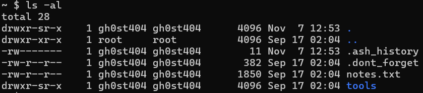
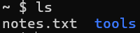

# Secret Stash

## Description
Look around for files that gh0st404 might have hidden - he’s a novice DEADFACE member so we suspect he probably hides files in the simplest way.

## Flag
deadface{hostbusters2_4685d0c801939781}

## Steps
1. Pada challenge kali ini kita diminta untuk mencari files yang disembunyikan oleh gh0st404. Kita coba menggunakan perintah `ls -al` untuk menampilkan daftar file dan direktori yang ada di direktori sekarang.

2. Dari daftar file diatas, file yang diawali dengan `.` adalah file yang di-hidden. Karena itu, bila kita hanya menggunakan perintah `ls` tanpa opsi `-al`, file yang diawali `.` tidak akan tertampil.

3. Kita bisa coba buka tiap hidden file yang dimiliki gh0st404 dengan perintah `cat`. Flag berada di dalam file `.dont_forget`.