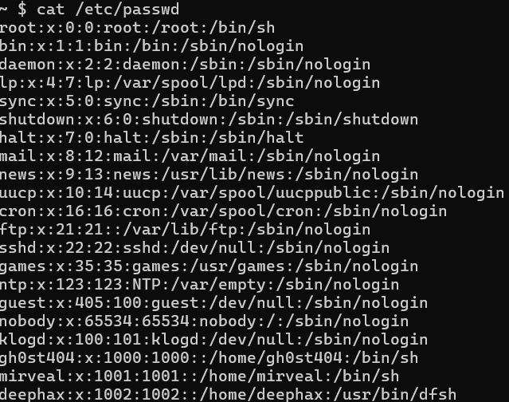
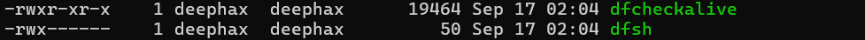
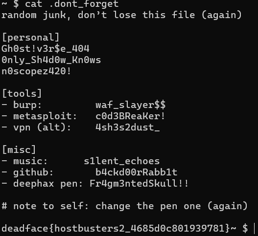
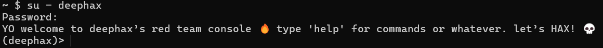
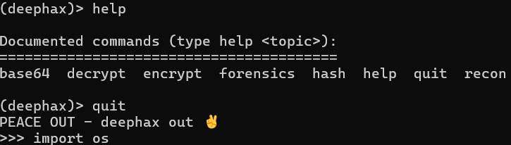
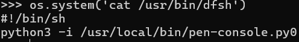
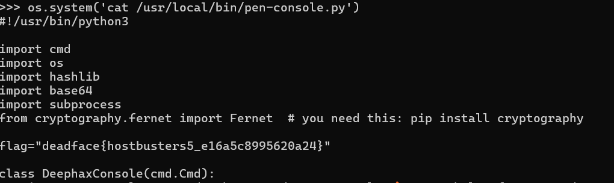

# Worldwide

## Description
The system seems to have multiple users, one of which is deephax. There’s a GhostTown thread between gh0st404 and deephax talking about a pen-console.py being deephax’s default shell. He also mentions giving gh0st404 his password. Look around the machine and see if you escalate laterally to deephax’s account. There may be information we can use (i.e., flag) in deephax’s shell environment.

## Flag
deadface{hostbusters5_e16a5c8995620a24}

## Steps
1. Tujuan akhir challenge ini adalah file shell environment milik deephax. Kita bisa menampilkan file `/etc/passwd` untuk melihat default shell yang digunakan oleh deephax.

2. Default shell deephax berada di /usr/bin/dfsh, bukan pen-console.py(?). Dengan user gh0st404 yang kita gunakan sekarang, kita tidak bisa membaca file dfsh, karena permissionnya hanya untuk deephax.

3. Kalau begitu kita harus login sebagai user deephax untuk bisa mengakses file tersebut. Di deskripsi dijelaskan bila deephax memberikan passwordnya ke gh0st404, dimanakah? 

4. Kalau kita buka lagi file `.dont_forget` dari challenge Secret Stash, dalam file tersbut gh0st404 mencatat password yang diberikan deephax, yaitu `Fr4gm3ntedSkull!!`.

5. Karena kita sudah mendapatkan password user deephax, kita akan login menggunakan perintah `su - deephax` dan masukkan password tadi.

6. Kita sudah berhasil masuk ke dalam defaultshell milik deephax. Kita coba gunakan `help` untuk melihat apa saja yang bisa kita lakukan di dalam shell ini. Ketika kita memasukkan command `quit`, kita berada di Python-REPL atau Python Interactive Shell.

7. Karena kita di dalam Python-REPL, kita tidak bisa menggunakan perintah linux. Untuk bisa melakukannya, kita lakukan import library os terlebih dahulu dengan menuliskan `import os`.

8. Kini, kembali ke tujuan sebelumnya, kita ingin membaca file dfsh, kita bisa lakukan dengan perintah `os.system('cat /usr/bin/dfsh')`.

9. Ternyata alasan kita berada di dalam Python-REPL saat memasukkan command `quit` tadi adalah opsi `-i` di file `dfsh`. Kita juga tahu file `dfsh` menjalankan script python di `/usr/local/bin/pen-console.py`, sesuai dengan deskripsi challenge.

10. Sekarang kita akan coba buka file `pen-console.py` dengan perintah `os.system('cat /usr/local/bin/pen-console.py')` dan flag yang kita cari tertulis di file ini.
