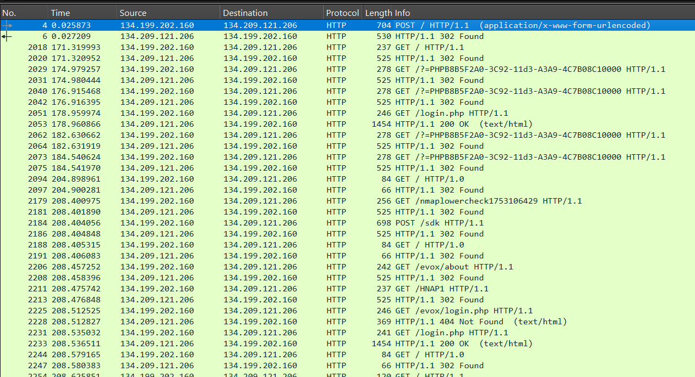
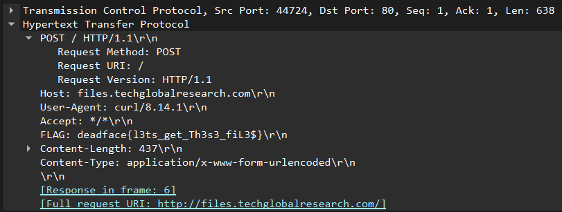

# Calling Card

## Description
DEADFACE has left a taunting message in their initial probing of the MyShare web application at http://files.techglobalresearch.com. Their attack involves a simple HTTP request with a hidden flag. Can you uncover their calling card?

## Flag
deadface{l3ts_get_Th3s3_fiL3$}

## Steps
1. Pada challenge ini, kita harus melihat HTTP request, dari file network traffic yang diberikan, di wireshark. 

2. Karena ini adalah calling card, kita asumsikan flag diletakkan ketika DEADFACE attacker akan memulai serangan, yaitu HTTP request paling awal.

3. Ternyata benar, pada request pertama terdapat header FLAG.
