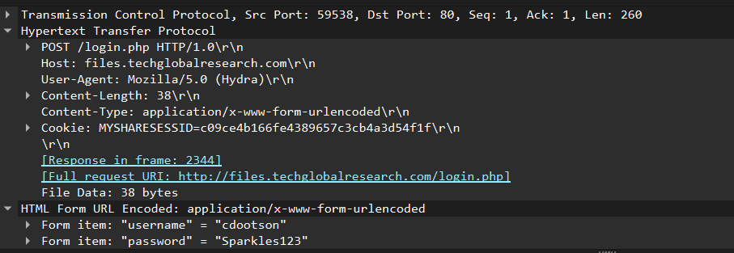
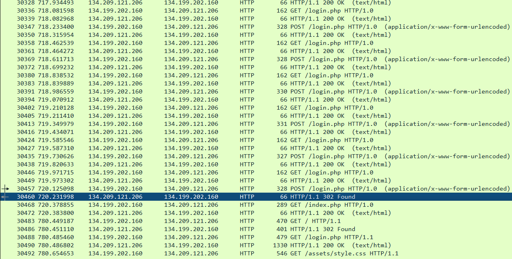
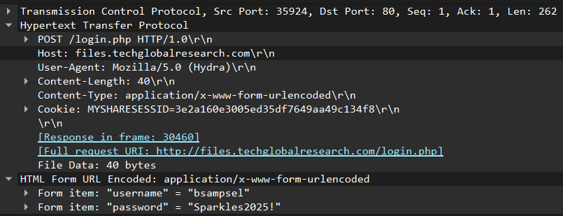

# Compromised

## Description
Which user did DEADFACE compromise and what was that user’s password?

## Flag
deadface{bsampsel_Sparkles2025!}

## Steps
1. Pada challenge ini, kita harus mencari user yang digunakan oleh DEADFACE untuk login. Berdasarkan file `cap-1753106207.pcap`, kita bisa melihat DEADFACE mencoba melakukan bruteforce pada login page.

2. Kita cari HTTP request dari banyak percobaan itu dengan response `302 FOUND`.

3. Kita buka HTTP request yang berhasil, sehingga kita bisa melihat username dan password yang didapatkan DEADFACE.
