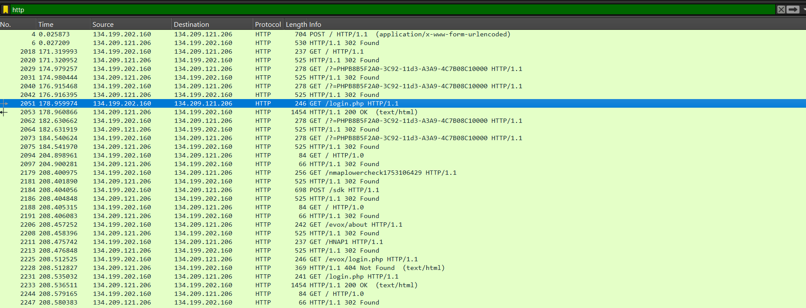

# The Source

## Description
A department at TGRI was getting lazy with sensitive files. Rather than use the company’s approved filesharing application, a member used an application called MyShare and forgot to configure it to run HTTPS.

DEADFACE found the site and were able to compromise it and steal several sensitive files. Based on DEADFACE’s past behavior, let’s assume that flags discovered may be used as DEADFACE passwords.

First thing’s first: what is the IP address of the DEADFACE attacker? 

## Flag
deadface{134.199.202.160}

## Steps
1. Kita buka file cap-1753106207.pcap dengan wireshark dan kita analisis. Di deskripsi challenge dijelaskan bahwa target DEADFACE adalah aplikasi MyShare dan tidak dikonfigurasi ke HTTPS. Sehingga, dengan wireshark kita bisa filter packet HTTP.

2. Pada gambar diatas dapat dilihat, IP yang berkomunikasi adalah `134.199.202.160` dan `134.209.121.206`. IP yang dimiliki oleh DEADFACE attacker bisa ditentukan pada IP source dari request packet HTTP (packet dengan GET atau POST didalamnya), yaitu 134.199.202.160