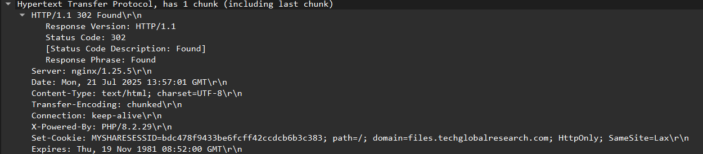

# Versions

## Description
Based on the network traffic, what web server software and version is MyShare running?

## Flag
deadface{nginx_1.25.5}

## Steps
1. Untuk mengetahui web server dan versi yang digunakan oleh MyShare, kita bisa lihat pada HTTP response dari file network traffic yang diberikan.

2. Terlihat informasi server dan versinya pada header `Server: nginx/1.25.5\r\n`