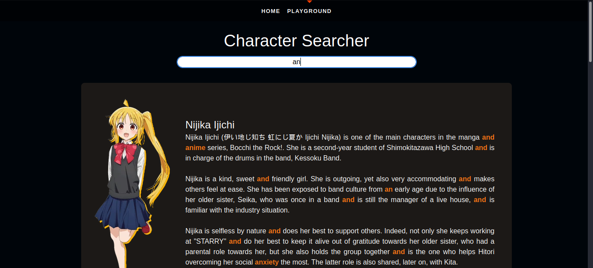

#SQLI

##Alat
* Burp Suite

##Steps to Reproduce
1. Pertama, kita cari input box yang bisa kita eksploitasi dengan sqli pada website. Yang pasti input di character searcher itu bisa kita eksploitasi (karna cuma ada itu aja).

2. Setelah itu gunakan burp suite untuk menangkap http requestnya. Ternyata request dari input query kita melalui path /api/search .

3. http request tadi kita send ke repeater. Lalu, jika kita lihat pada kedua hint-nya, kita bisa tau kalau website ini menggunakan db sqlite dan sqli nya akan menggunakan syntax union select.
4. kita coba inject syntax sql ORDER BY.
ternyata, input kita mendapat respon valid, ini berarti input boxnya vulnerable terhadap sqli.

5. kita akan tambah terus angkanya hingga responsenya tidak valid.

6. input order by 4 tidak valid, berarti kita akan menginject syntax UNION SELECT hingga 3.

7. setelah search google tentang bagaimana cara menampilkan table name di sqlite, saya baca-baca https://www.sqlite.org/faq.html. 
Lalu saya coba dan menemukan `SELECT tbl_name FROM sqlite_schema;` itu bisa digunakan. bila digabung dengan union select menjadi `UNION SELECT 1,2,tbl_name FROM sqlite_schema;`

8. Bisa dilihat terdapat table bernama flag. Kita coba tampilkan column pada table flag tersebut dengan syntax `SELECT * FROM flag;`

Dengan begitu kita sudah mendapatkan flagnya.
